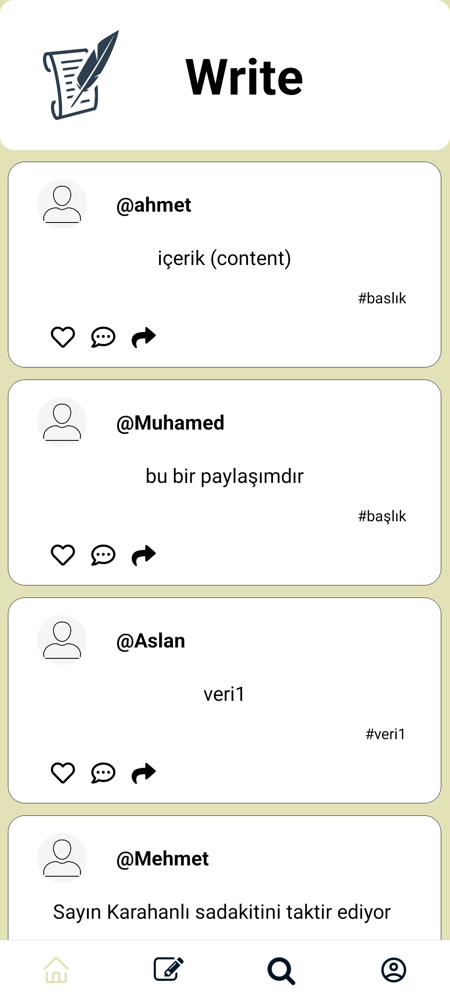
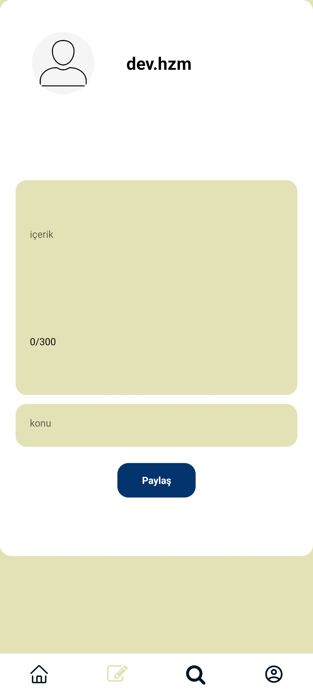
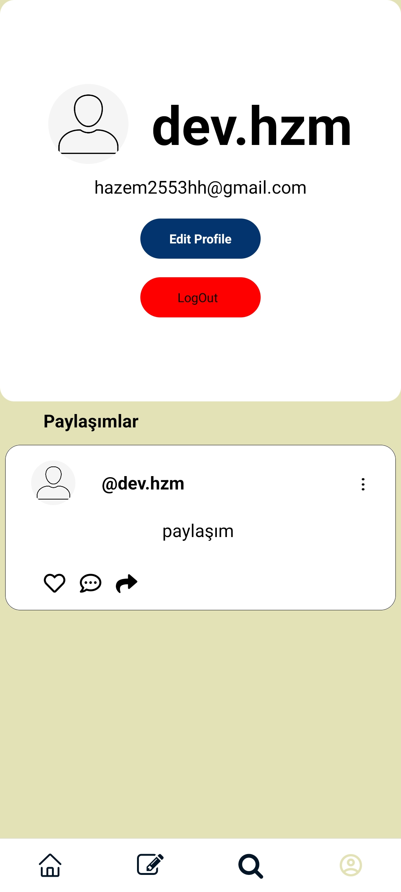
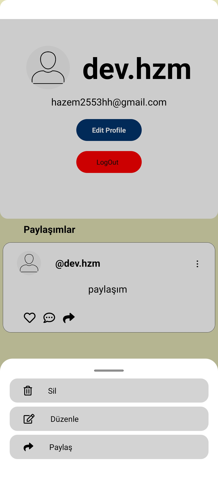
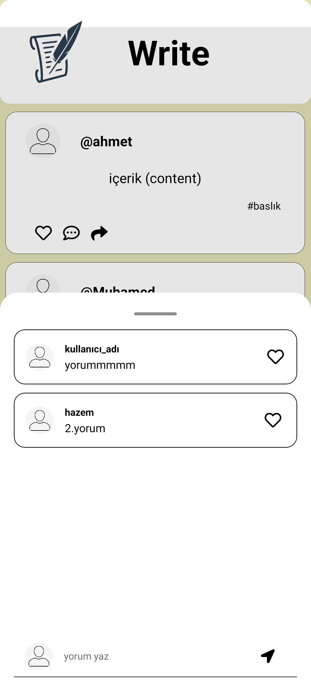

# Write

Kullanıcıların post paylaşmalarını ve diğer kullanıcılarla etkileşim içine girmelerini sağlayan, basit anlamda bir sosyal medya platformudur.


## Screenshots




## Screenshots




## Screenshots


## Screenshots




## Screenshots







## Installation

 

```bash
  git clone https://github.com/hzmj07/yolcu
  
  npx install-expo-modules@latest


  cd yolcu
  npx expo start
```
    


    
## 🚀 About Me
React Native Mobile Developer


## 🔗 Links


[](https://www.linkedin.com/in/hazem-aljasem/)

